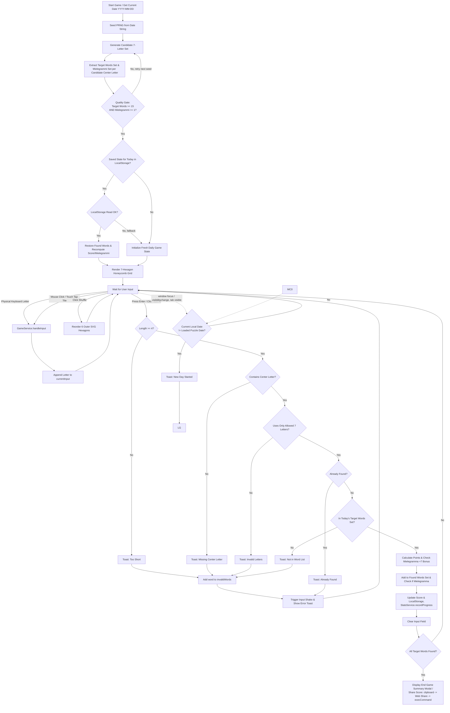

# Game Logic Flowchart

> Updated to reflect: the Candidate Pangrams puzzle-generation strategy, explicit loading/error/retry states, invalid-word tracking, and career/streak statistics recording. See `requirements.md` and `data-models.md` for full detail.

